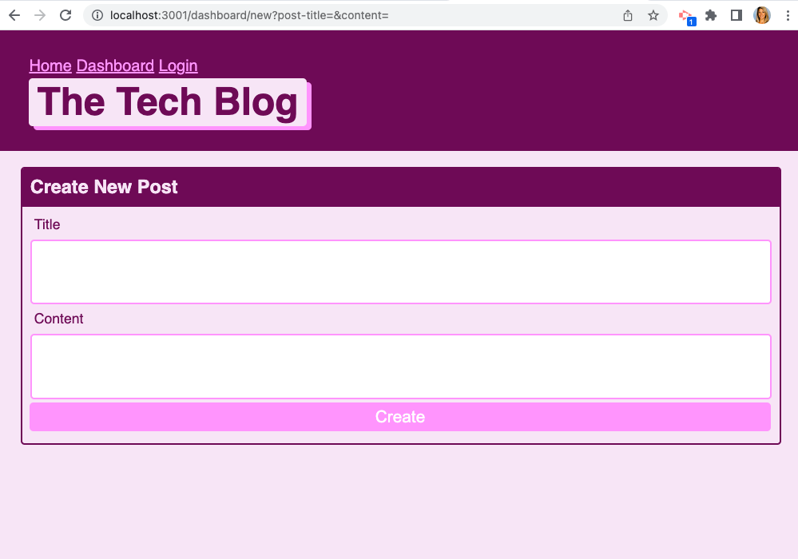

# Model-View-Controller (MVC) Challenge: Tech Blog

## Project Description
CMS-style blog site similar to a Wordpress site, where developers can publish their blog posts and comment on other developers’ posts as well. This site is built from scratch and deployed to Heroku. The app follows the MVC paradigm in its architectural structure, using Handlebars.js as the templating language, Sequelize as the ORM, and the express-session npm package for authentication.

## User Story 
AS A developer who writes about tech
I WANT a CMS-style blog site
SO THAT I can publish articles, blog posts, and my thoughts and opinions

## Image
    

## Deployed Heroku link
https://sleepy-sea-11786.herokuapp.com/